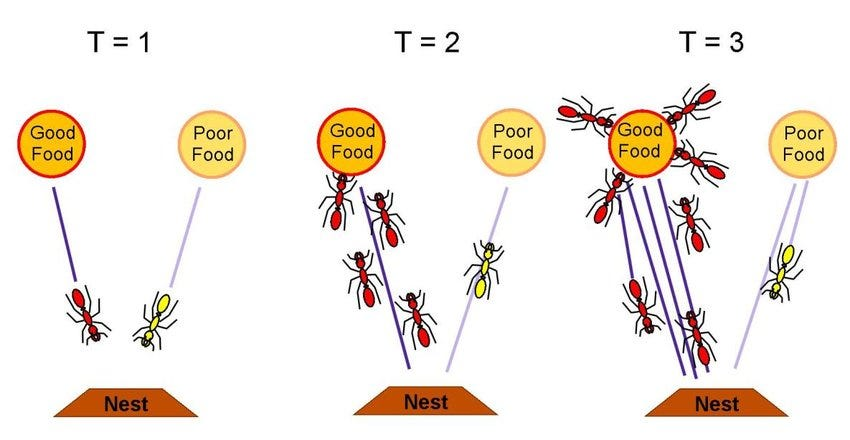

# TSP Ant Colony Optimization Visualizer



## Overview
This project implements the **Ant Colony Optimization (ACO)** algorithm for solving the **Traveling Salesman Problem (TSP)** using Python, with a **Streamlit-based interactive visualizer**. Users can watch ants explore nodes, see pheromone trails, and understand how the algorithm converges to the best solution.

The project also saves **run data**, including per-iteration statistics, coordinates, pheromone matrices, and plots, for further analysis.

---

## About Ant Colony Optimization (ACO)
ACO is a **bio-inspired optimization algorithm** based on the foraging behavior of ants. In nature, ants deposit pheromones on paths between their nest and food sources. Other ants probabilistically follow stronger pheromone trails, reinforcing good paths over time. In TSP, artificial ants simulate this behavior to explore routes between cities, update pheromones based on tour quality, and iteratively converge to near-optimal solutions.

---

## Features

- **Interactive node generation:**
  - Random
  - Manual
  - File upload
  - Fixed seed (for reproducibility)
- **Run control:**
  - Number of nodes
  - Number of ants
  - Iterations
  - Algorithm parameters (`alpha`, `beta`, `rho`, `q`)
- **Visualization:**
  - Node scatter plot with indices
  - Real-time ant tours and pheromone heatmap
  - Aggregated plots of all runs
- **Results management:**
  - Each run saved in `results/YYYYMMDD_HHMMSS/`
  - CSV of per-iteration statistics
  - Final best tour plot
  - Pheromone matrix
  - Node coordinates
- **Easy to run:**
  - Fully compatible with Windows, Linux, Mac
  - One command to launch via Streamlit

---

## Installation

1. Clone the repository:
```bash
git clone https://github.com/yourusername/tsp-aco.git
cd tsp-aco
```

2. Create and activate a virtual environment:
```bash
python -m venv .venv
.\.venv\Scripts\activate    # Windows
source .venv/bin/activate     # Linux/Mac
```

3. Install dependencies:
```bash
pip install -r requirements.txt
```

4. Run the Streamlit app:
```bash
streamlit run streamlit_app.py
```

Or use the provided batch file (Windows):
```bat
run.bat
```

Or use the provided bash file (Linux/Mac/WSL):
```bat
run.sh
```

---

## Algorithm Parameters
| Parameter | Default | Description |
|-----------|---------|-------------|
| `n_nodes` | 20      | Number of cities/nodes in the TSP instance |
| `n_ants`  | 40      | Number of ants constructing tours per iteration |
| `n_iters` | 200     | Number of iterations to run the ACO algorithm |
| `alpha`   | 1.0     | Importance of pheromone in decision making |
| `beta`    | 5.0     | Importance of heuristic (distance) in decision making |
| `rho`     | 0.5     | Evaporation rate of pheromone per iteration |
| `q`       | 1.0     | Pheromone deposit factor |
| `seed`    | 0       | Random seed (0 = random) |

> **Why these defaults?**
> - Moderate number of nodes (20) for fast interactive visualization.
> - Enough ants (40) to explore solutions but keep runtime reasonable.
> - `beta > alpha` emphasizes heuristic distances initially.
> - Evaporation rate `rho=0.5` balances exploration and exploitation.

---

## Usage

### Node Selection
- **Random:** Generates nodes randomly.
- **Manual:** Allows you to place nodes manually.
- **File Upload:** Load a CSV of coordinates.
- **Fixed Seed:** Generates the same random instance for reproducibility.

### Running the Algorithm
- Adjust the parameters in the sidebar.
- Click **Run ACO** to start the algorithm.
- Observe real-time visualization:
  - Left: best tour
  - Right: pheromone heatmap
- After completion, all artifacts are saved in a timestamped folder in `results/`.

### Aggregated Plots
- Click **Show aggregated plot of all runs** to compare the global best length of multiple runs.

### Saved Files Per Run
- `per_iteration.csv`: Iteration-by-iteration statistics
- `coords.csv`: Node coordinates
- `pheromone.csv`: Final pheromone matrix
- `best_tour.png`: Best tour visualization
- `params.json`: Algorithm parameters
- `summary.json`: Summary of best tour and length

---

## Folder Structure
```
tsp-aco/
│
├─ streamlit_app.py       # Main UI
├─ requirements.txt
├─ run.bat                # Windows run script
├─ run.sh                 # Linux/Mac/WSL run script
├─ src/
│   ├─ aco.py             # Ant Colony implementation
│   ├─ tsp_utils.py       # Utilities (distance, folders, CSV/JSON)
│   └─ visualizer.py      # Plotting functions
└─ results/               # Saved runs
```

---

## Dependencies
- Python 3.10+
- numpy
- pandas
- matplotlib
- streamlit
- tqdm

Install all via:
```bash
pip install -r requirements.txt
```

---

## License
MIT License

---
